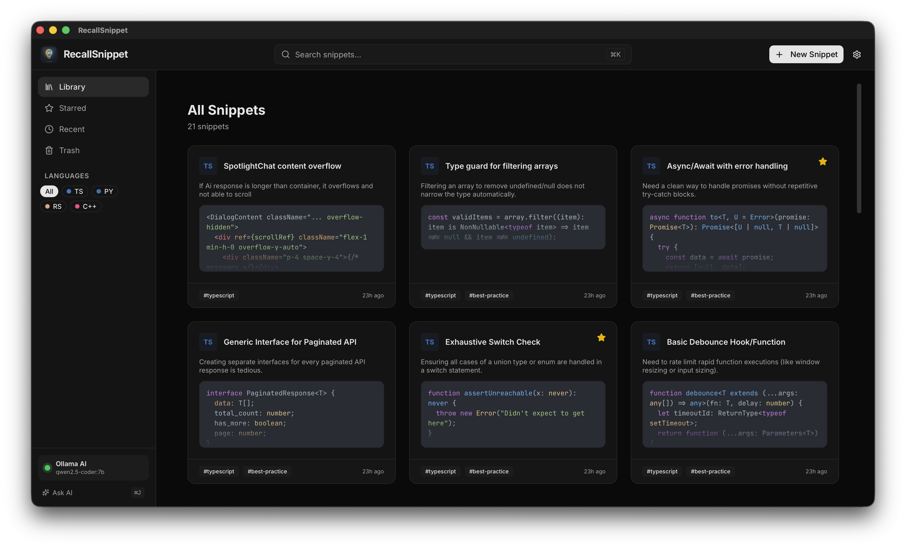
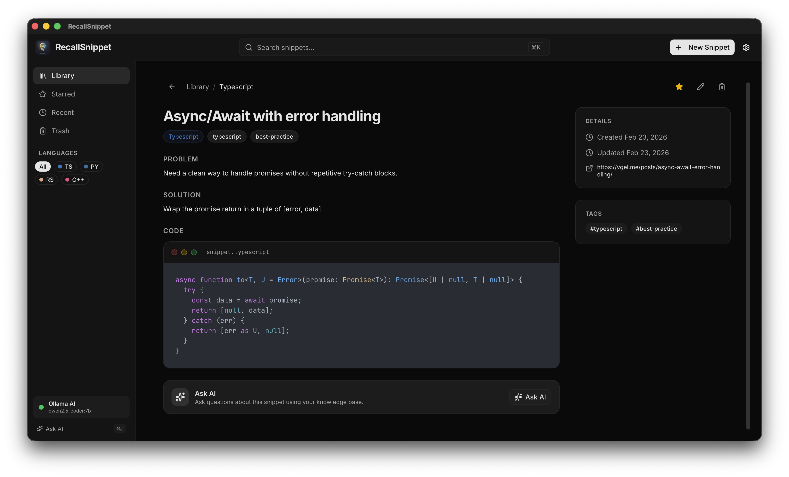
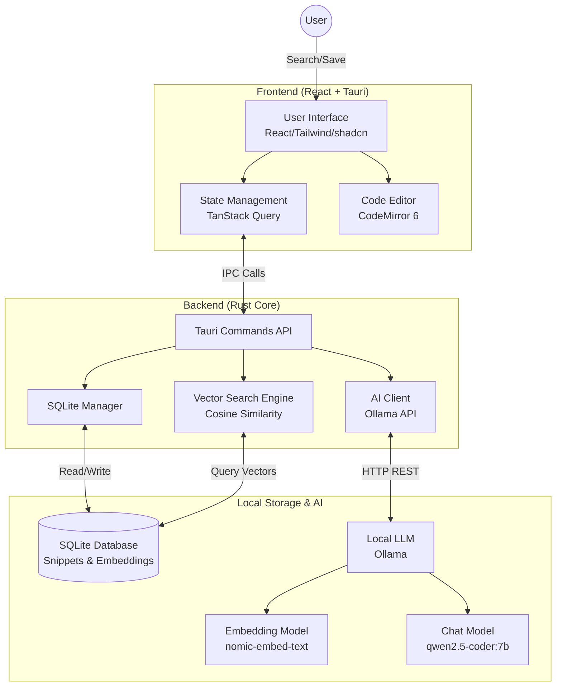

# RecallSnippet

> **Personal AI Knowledge Base for Developers**  
> Store snippets, solve problems, and recall solutions instantly with a local-first AI assistant.

RecallSnippet is a modern, privacy-focused desktop application built with **Tauri v2**, **React**, and **Rust**. It combines a robust code snippet manager with a local AI (Ollama) to help you organize your coding knowledge and solve repetitive problems faster.


<br/>

<div align="center">
  
  <p><em>Main Dashboard & Snippet Search</em></p>
</div>

<br/>

<div align="center">
  
  <p><em>Note Detail & AI Auto Tagging</em></p>
</div>

---

## ✨ Features

- **Store & Organize**: Save code snippets with rich metadata, tags, and language syntax highlighting.
- **Local AI Integration**: Connects to your local **Ollama** instance to analyze snippets and generate tags automatically.
- **Semantic Search**: Find snippets not just by keywords, but by _meaning_ using vector embeddings (powered by SQLite & Rust).
- **AI-Assisted Solving**: Stuck on a bug? Ask the AI helper to generate solutions or explanations based on your stored snippets.
- **Privacy First**: All data, including embeddings and AI processing, lives locally on your machine. No cloud dependencies.
- **Modern UI**: Clean, responsive interface with Dark/Light mode support, built with **shadcn/ui** and **Tailwind CSS**.

---

## 🛠️ Tech Stack

### Frontend

- **Framework**: React 19 + TypeScript
- **Styling**: Tailwind CSS v4
- **UI Components**: shadcn/ui + Lucide React
- **State Management**: React Query (TanStack Query)
- **Editor**: CodeMirror 6

### Backend (Desktop)

- **Framework**: Tauri v2
- **Language**: Rust
- **Database**: SQLite (rusqlite)
- **Vector Search**: Custom Cosine Similarity traversal in Rust
- **AI Client**: Ollama API integration

---

## Architecture


---

## 🚀 Getting Started

### Prerequisites

Before you begin, ensure you have the following installed:

1.  **Node.js**: v18+ (v22 recommended)
2.  **pnpm**: v10+ (Recommended package manager)
3.  **Rust**: Latest stable version (via `rustup`)
4.  **Ollama**: Installed and running locally.
    - Pull the embedding and chat models (recommended):
      ```bash
      ollama pull nomic-embed-text
      ollama pull qwen2.5-coder:7b
      ```

### Installation

1.  **Clone the repository**

    ```bash
    git clone https://github.com/kimjeffsj/recallsnippet.git
    cd recallsnippet
    ```

2.  **Install Frontend Dependencies**

    ```bash
    pnpm install
    ```

3.  **Run Development Server**
    ```bash
    pnpm tauri dev
    ```
    This will start the Vite server and launch the Tauri desktop application window.

### Building for Production

To create an optimized build for your OS (macOS, Windows, Linux):

```bash
pnpm tauri build
```

The output binaries will be located in `src-tauri/target/release/bundle/`.

---

## 📖 Usage Guide

### 1. Configure AI Settings

Go to **Settings** (gear icon) and ensure Ollama is connected.

- **Base URL**: `http://localhost:11434` (default)
- **Chat Model**: `qwen2.5-coder:7b` (or your preferred coding model)
- **Embedding Model**: `nomic-embed-text`

### 2. Create a Snippet

- Click **"New Snippet"** (⌘N).
- Paste your code, add a title and description.
- Use **"AI Tags"** to automatically generate relevant tags.
- Click **Save**.

### 3. Search & Recall

- Use the search bar (⌘K) to find snippets.
- Try searching with natural language (e.g., "how to parse json in python"). The semantic search will surface relevant code even if keywords don't match exactly.

--- 

## 🏗️ Project Structure

```
├── src/                # React Frontend
│   ├── components/     # UI Components (shadcn/ui, custom)
│   ├── contexts/       # React Contexts (App, Theme)
│   ├── hooks/          # Custom Hooks (useSnippets, useAI)
│   ├── lib/            # Utilities & Types
│   └── pages/          # Application Pages
├── src-tauri/          # Rust Backend
│   ├── src/
│   │   ├── ai/         # Ollama & Embedding Logic
│   │   ├── commands/   # Tauri Commands (Frontend-Backend API)
│   │   ├── db/         # SQLite Database & Migrations
│   │   └── models/     # Rust Data Structures
│   └── tauri.conf.json # Tauri Configuration
└── ...
```

---

## 🤝 Contributing

Contributions are welcome! Please feel free to submit a Pull Request.

1.  Fork the project
2.  Create your feature branch (`git checkout -b feature/AmazingFeature`)
3.  Commit your changes (`git commit -m 'feat: Add some AmazingFeature'`)
4.  Push to the branch (`git push origin feature/AmazingFeature`)
5.  Open a Pull Request

## 📝 License

This project is licensed under the MIT License - see the [LICENSE](LICENSE) file for details.
